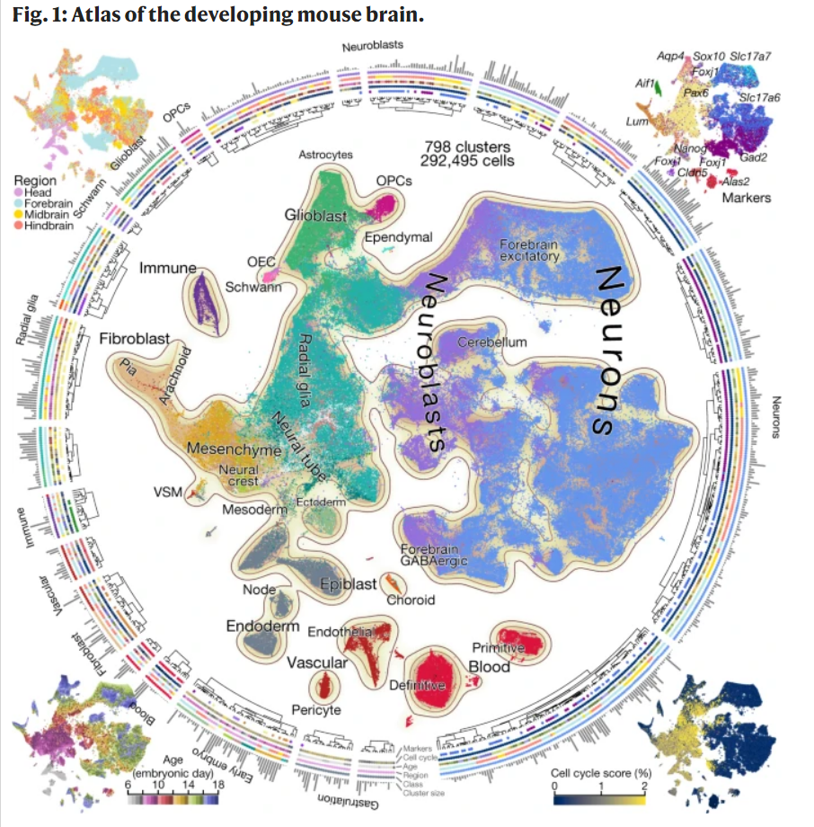

<!--
headingDivider: 1
backgroundColor: white
paginate: true
header: 2021年8月第2週
-->

# [B] マウス脳の細胞アトラスの作成

- Molecular architecture of the developing mouse brain | Nature
[https://www.nature.com/articles/s41586-021-03775-x](https://www.nature.com/articles/s41586-021-03775-x)

この論文では、あらゆるステージの脳を対象とした scRNA-seq データアトラスを作成し、800種類程度に細胞をクラスタリングし、その分類と in situ mRNA sequencing データと対応づけることで、神経系における細胞分化パターンを正確に捉えることに成功している。

このデータベースを基盤として、例えば小児の神経腫瘍の由来を特定し、分子標的薬を作成したり、あるいは神経障害の病態に寄与する細胞を特定出来ると期待される。

可視化は素朴に t-SNE を使っているようだが、それでもかなりきちんとしたマップになっている。約215個体、300000細胞について解析していて、これは米国や企業研究所などのものすごい財力のあるところの研究だろうか、と思ったが、スウェーデンの研究グループが主体のようだった。すごい。

# [B] 痛覚受容体 Cav2.2 チャネルとジコノチドの相互作用構造

- Structure of human Cav2.2 channel blocked by the painkiller ziconotide | Nature
[https://www.nature.com/articles/s41586-021-03699-6](https://www.nature.com/articles/s41586-021-03699-6)

非オピオイド性鎮痛薬として重度慢性疼痛に使われる、ジコノチドという医薬品があるらしい。米国では 2005 年ごろに承認されていて、エーザイがプリアルトという名前で欧州での販売権を2018年ごろまで保持していたらしいが、どうやら副作用が強く、かつくも膜下注射で投与する必要があり侵襲が強いためいまいちうまく使えていないようだ。日本ではどう使われているのか(そもそも承認されているのか)調べた限りだと分からなかった。

このジコノチドは神経細胞の Cav2.2 と呼ばれるイオンチャネルに結合し、その活性を阻害することでサブスタンスPなどの痛覚を伝導する神経伝達物質の放出をブロックすることで鎮痛を促すとされているが、その結合構造については未だに分かっていなかった。

この論文ではジコノチドの Cav2.2 への結合構造を特定することで、副作用を抑えるための適切な戦略を探ることが出来ると主張している。この段階では構造が明らかになるところまでだが、使いやすい薬剤になるとオピオイドに頼らない鎮痛方法が現実的な選択肢になるという点で主に緩和医療に大きな前進をもたらすと思われる。

# [TM] クローズド・ループ インスリン療法による2型糖尿病治療

- Fully automated closed-loop glucose control compared with standard insulin therapy in adults with type 2 diabetes requiring dialysis: an open-label, randomized crossover trial | Nature Medicine
[https://www.nature.com/articles/s41591-021-01453-z](https://www.nature.com/articles/s41591-021-01453-z)

糖尿病患者さんの生活として、毎日頻回の血糖測定をして、それに応じてインスリンの量を調整して自己注射して、という大変負担の大きいものがある。値を見て量を調節して決まった時間に注射する、という工程を考えれば、これくらい簡単に自動化できるんじゃないか？というのは自然な発想だと思う。

これを実現したクローズド・ループインスリンシステムを用いて血糖コントロールの質を評価したのが今回の論文で、(1) 血糖値が適切な範囲に保たれている時間の長さ (2) 平均血糖値 (3) 低血糖時間の短さ について、標準的なインスリン療法よりも改善されると主張している。

1型糖尿病の方への応用や、2型糖尿病の入院患者さんへはすでに応用されているらしい。難しいとは思うが、血糖・インスリン量の点で健常者と遜色ないレベルで制御できるようになれば、膵移植などのリスクの高い治療を回避でき、生命予後や経済性の改善が見込めるように思う。

- 持続血糖測定器：[https://www.terumo.co.jp/pressrelease/detail/20210727/1203/](https://www.terumo.co.jp/pressrelease/detail/20210727/1203/)
- インスリンポンプ：[https://mds.terumo.co.jp/guideline/mdswith/index.html](https://mds.terumo.co.jp/guideline/mdswith/index.html)

# [TM] アルツハイマー病を血液検査で判定する

- Phenotyping Alzheimer's disease with blood tests | Science
[https://science.sciencemag.org/content/373/6555/626](https://science.sciencemag.org/content/373/6555/626)

アデュカヌマブが承認されたことを受け、ではアルツハイマー病であることを比較的簡単に見出すことが出来ないか？という課題の価値が高まっている。現在は以下のようなバイオマーカーが使えるようだ。

- Aβ40 と Aβ42 (脳に沈着するのは Aβ42の方) の比
- pTau181 断片、pTau217 断片、pTau231 断片
- Neurofilament light
- GFAP (アストロサイト産生タンパク)

特に pTau231断片 を用いる方法では 99% 程度の精度で患者群と対照群を分類出来るらしい。この患者群自体は PET の検査結果と分けているようなので、本当は認知機能との関わりを知りたいところだが。

# [B] 対恐怖シグナルとしての ERK

- β-Arrestin–dependent ERK signaling reduces anxiety-like and conditioned fear–related behaviors in mice | Science Signaling
[https://stke.sciencemag.org/content/14/694/eaba0245](https://stke.sciencemag.org/content/14/694/eaba0245)

不安・恐怖行動を担う機構として、神経細胞における Gタンパク質共役型受容体を介したシグナルが知られている。オピオイド受容体もその一種で、モルヒネなどを服用することで不安が軽減されることはよく知られている (それが依存などに繋がることが時折危惧される)。

今回この論文では、この不安が軽減される機構として、 GPCR のシグナルが β-アレスチンによって修飾されることで ERK 活性が扁桃体で高まり、その結果として不安や恐怖と関連した行動が減少することをマウスモデルで明らかにしている。

ERK、細胞生物学的には細胞運動とか細胞増殖とか、細胞骨格に関わるような経路というイメージが強いので、神経でも役割を持っているというのは意外だった。

# [TM] 悪液質のひとつの原因

- Perturbed BMP signaling and denervation promote muscle wasting in cancer cachexia | Science Translational Medicine
[https://stm.sciencemag.org/content/13/605/eaay9592](https://stm.sciencemag.org/content/13/605/eaay9592)

がんが死に至る病であることは周知の事実だと思うが、細胞が無限に増殖し、各地に転移するという性質から、個体の死までどのようにつながっているのかはあまり自明ではないと感じていた。異常増殖に伴う組織障害や循環障害など複合的な要因によるものだが、その一つに悪液質と呼ばれる、腫瘍による代謝の変化に伴って骨格筋や脂肪組織が萎縮する症状がある。

この論文は悪液質が BMP シグナルの低下により生じている可能性を示唆している。担癌患者の骨格筋において BMP シグナルの低下・神経筋接合部の障害があること、またマウスモデルで BMP シグナルを薬理的・遺伝学的に補うことで骨格筋の萎縮を抑制できることが確認出来ており、BMP 経路を標的とした悪液質への薬物治療に繋がることが期待される。

この論文では Tilorone と呼ばれる薬剤を腹腔内注射することで BMP シグナルのレスキューをしているが、この薬剤は Amixin という名前でウイルス性肝炎治療などで使われているらしい(主にロシアで？)。

- Tilorone - Wikipedia [https://en.wikipedia.org/wiki/Tilorone](https://en.wikipedia.org/wiki/Tilorone)

そちらで割と使われているということなら、安全性については比較的簡単にパスできる？

# [TB] 遷移行列のアンサンブルで相転移を生む

- Phys. Rev. E 104, 024305 (2021) - Breakdown of random matrix universality in Markov models
[https://journals.aps.org/pre/abstract/10.1103/PhysRevE.104.024305](https://journals.aps.org/pre/abstract/10.1103/PhysRevE.104.024305)

長距離秩序などの臨界現象を起こすに当たっては、いわゆる"温度"がちょうど臨界温度になっている必要があるが、そういった外部の影響なく相転移などを起こす系として、ランダム行列のアンサンブルを用いる方法があり、その重み付けを "温度" のようにみなして類似の振る舞いを起こすことが出来る、らしい。

生物学的な系については、磁性体で用いられているようなモデル (Ising 的なもの) よりもこちらのほうがもっともらしいのではないかということのようだが、臨界現象の詳細についてはちょっと難しくて分からない。

# [ML] 病理画像と遺伝子発現を統合した解釈可能な深層学習モデル

- [2108.02278] Pan-Cancer Integrative Histology-Genomic Analysis via Interpretable Multimodal Deep Learning
[https://arxiv.org/abs/2108.02278](https://arxiv.org/abs/2108.02278) [https://github.com/mahmoodlab/PORPOISE](https://github.com/mahmoodlab/PORPOISE)

Whole slide image と RNAseq の結果の双方を使って予後を予測する深層学習モデルを作成し、かつそこから予後に大いに影響する形態的な特徴と遺伝子変異を抽出する、という研究。

まずモデルとして、画像は Attension-based multiple instance learning network を使って処理し、RNA量・コピー数浮動・点変異を Self-normalizing network を使って処理し、それぞれの特徴量をクロネッカー積を用いて融合させ、最終的に生存期間の予測をするという構造になっており、最終的には腫瘍組織へのリンパ球の浸潤が形態的な特徴としては重要だという知見も得られている。

5720人の患者さんから得られたデータを使っており、すごいデータ量だと思ったら Harvard medical school だった。さすが。

# [B] 食道胃接合部での棲み分けを維持する方法

- Spatial organisation and homeostasis of epithelial lineages at the gastroesophageal junction is regulated by the divergent Wnt mucosal microenvironment | bioRxiv
[https://www.biorxiv.org/content/10.1101/2021.08.05.455222v1](https://www.biorxiv.org/content/10.1101/2021.08.05.455222v1)

食道と胃の上皮構造は、それぞれ扁平上皮と腺上皮であり、この境目の上皮は逆流性食道炎などに起因して化生を起こし(バレット食道などと呼ばれる)食道がんの原因になったりなどする。正常な個体ではつなぎ目でちょうど上皮が切り替わるわけだが、そのような棲み分けを形成する機構は分かっていなかった。

この論文では、この接合部の下にある間質が分泌する Wnt シグナルの強さに応じて扁平上皮・腺上皮の増殖が制御され、その結果棲み分けが維持されていることを明らかにしている(意外なことに、分化には影響しないらしい)。

ではこの Wnt シグナルの違いはどのように生み出されているのかが気になるところだが、食道上皮側からの Wnt 阻害タンパクである Dkk2 発現と、胃上皮側からの Wnt 誘導タンパクである Rspo3 発現によって制御されていることが示唆されている。

この2種のタンパクの勾配形成によって出来ているとすると、片方で発現を変化させることで、境界部位を上下させられるんじゃないかという気がするが、そのあたりは続報が望まれる。