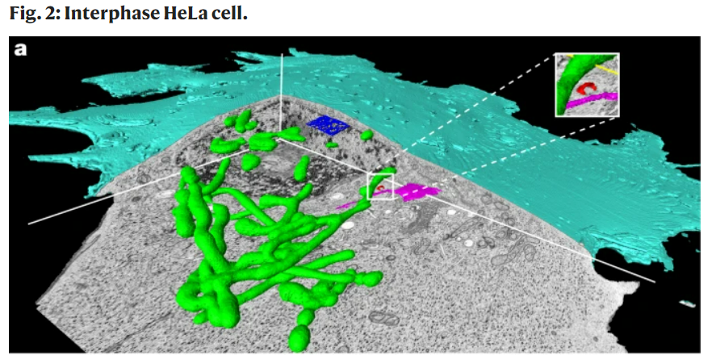
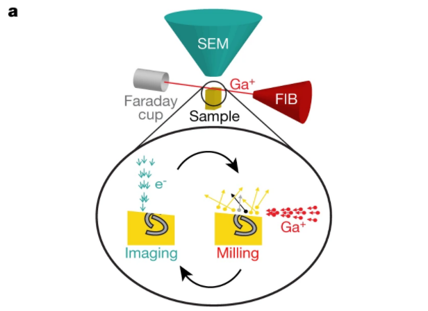
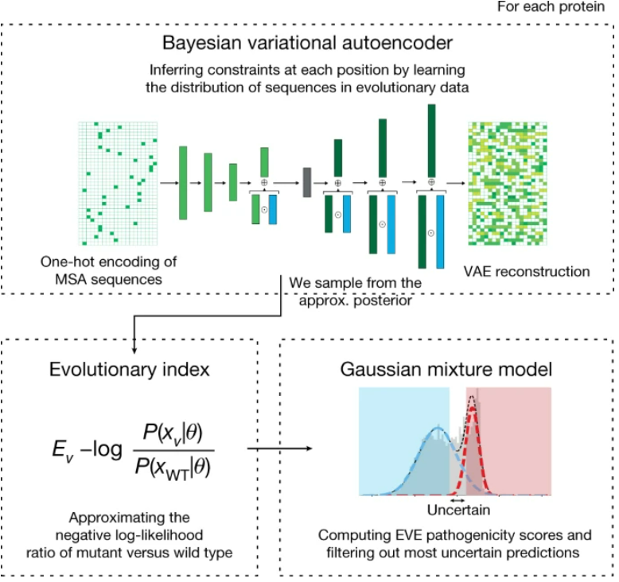
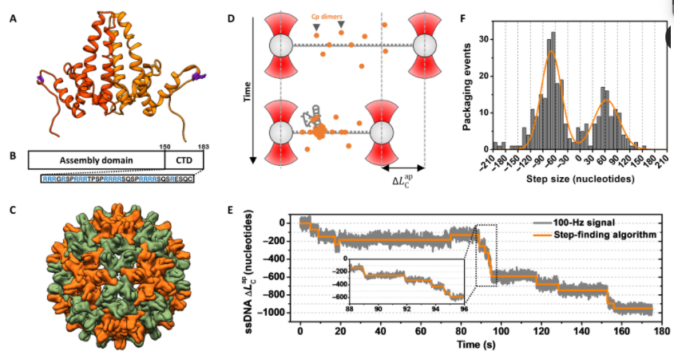

<!--
headingDivider: 1
backgroundColor: white
header: 2021年11月第2週
-->

# [B] 電顕写真の3Dデータアトラス
> An open-access volume electron microscopy atlas of whole cells and tissues | Nature
https://www.nature.com/articles/s41586-021-03992-4

+ 空間分解能は 4nm まで向上して、従来の3D電顕画像と比較すると2桁の改善したらしい。
+ 右上の画像は緑がミトコンドリア、赤がゴルジスタックらしい。これくらいわかりやすい画像なら教科書にも載るんじゃないか
+ ミトコンドリアが楕円形だと思っている世代とチューブ状だと思っている世代でギャップが生まれそう。
+ 撮影して Ga+ ビームで剥ぐ、というのを繰り返すことで3D形態を構成しているようだ。夢がある。

# [ML] 深層生成モデルによる疾患バリアント予測
> Disease variant prediction with deep generative models of evolutionary data | Nature 
https://www.nature.com/articles/s41586-021-04043-8

+ 疾患原因遺伝子の変異がどのような病態を引き起こすか？を予測したい
+ 素朴には教師データ用意して深層学習 → ラベル依存、かつあまり正確でないという問題が
+ 今回は深層生成モデルを使うことで教師なし的に病原性を予測する。

+ 各タンパク質について、その変異の分布を計算、 VAE で次元削減して Evolutionary index を計算する、これが適応度を反映しているので、ここから pathogenicity score を計算、と書かれているが、良く分からない。
  + まず変異の頻度が適応度を反映できているのかが良く分からない。
  + すでに見られる変異は、入っても問題ない変異が大体数で、入って問題ある変異が入った人は死んでしまうので数は少ない、というイメージなんだろうか？そうなると生存にどの程度関わるかで精度が変わってきそうな気がする。
  + 一応腫瘍っぽい遺伝子を対象にしているか。

+ 従来の教師あり学習モデルと比較しても、 State of the art な予測性能が得られたらしい。

# [P] 相互作用するアクティブ振動子によるパターン形成
>Phys. Rev. E 104, L052201 (2021) - Bumps, chimera states, and Turing patterns in systems of coupled active rotators https://journals.aps.org/pre/abstract/10.1103/PhysRevE.104.L052201

+ Kuramoto モデルに似たモデルで、一部 synchronize しているがそうでない領域もある、という Chimera states や、Bump state が存在するモデルが構成できる
$$
\begin{aligned}
\frac{d \theta_{j}}{d t}=& 1-a \cos \theta_{j}-\frac{K_{1}}{2 P+1} \sum_{k=j-P}^{j+P} \sin \left(\theta_{j}-\theta_{k}+\alpha\right) +\frac{K_{2}}{N} \sum_{k=1}^{N} \sin \left(\theta_{j}-\theta_{k}\right), \quad j=1, \cdots, N
\end{aligned}
$$
+ 局所的な相互作用と非局所的な相互作用の両方があり、振動数は固定だが等速では無い。
+ この時のパラメータとパターンの相図が figure になっていた。
+ 局所・非局所の相互作用、Kernel による畳込みで書ける気がする。線形とみなしてしまえば(sin(x)→x) 解析的に扱えそうだが、それだと bump state とか起きない気もする。
+ PRE の Letter でこういう話が載るというのはうれしい。

# [DB] 着床の in vitro assay モデル
> 3D biomimetic platform reveals the first interactions of the embryo and the maternal blood vessels: Developmental Cell
https://www.cell.com/developmental-cell/fulltext/S1534-5807(21)00845-5#
+ 着床は発生において言うまでもなく重要な過程だが、子宮内でしか起こせないので観察し難いという困難があった。
+ そこで子宮を模した3次元培養環境を構築して観察を可能にした。
+ 栄養膜細胞(絨毛細胞)が母体に侵入する過程を追跡でき、PDGF シグナルなどが栄養膜細胞の集団運動を誘導していることが明らかになった。
+ この前 NHK の科学番組で着床のアニメーションがやっていたが、言われてみればタイムラプス観察は難しいよな。
+ Figure を見るとLeader cell とおぼしき細胞が居る。

+ これほどまでに暴力的に侵入する様子を見ると、胞状奇胎
などはものすごく悪性な気がしてくるが、そこまで予後が
悪くないのはやはり他者の細胞なので免疫が機能するとい
うこと？

# [TM] 拡張型心筋症への Titin タンパク質切断バリアントの関わり
> Truncated titin proteins in dilated cardiomyopathy
https://www.science.org/doi/10.1126/scitranslmed.abd7287
+ TTN タンパクの切断バリアント(TTNtv)が拡張型心筋症の発症に関わることは知られていたが、そのメカニズムは不明だった。
+ 心臓移植後の拡張型心筋症患者の心臓 184 サンプルを用いて以下のことを見出した
  + TTNtv が実際に存在すること
  + TTNtv はアレルにコードされていて、完全長タンパクが切断されて出現しているわけでは無さそう(切断断片は検出されず)
  + 切断箇所(切断バリアントのサイズ)と病勢(移植必要性・重症度)に相関がないこと
  + in vitro assay において心筋細胞レベルでは収縮力に TTNtv の有無は影響しないこと

Titin は Z 板間を結ぶ巨大タンパク質で、ミオシンフィラメントなどの配置の頑強性に寄与したり、タンパク質そのものの物性によって収縮状態から戻ることに作用すると考えられているらしい。
今回の話は要するに切断バリアントが存在していることが病態を形成しているのか、それとも TTN の発現量が落ちてしまうことが病態を形成をしているのかに答えを出そうとした取り組みなんだと思うが、結果としてははっきりせず、多分どちらも関わっているんだろうという話なのだろうか。
TTNtv の浸透率は 5％程度なので、他の "second hit" も病態の形成に必要なんだろうと主張していた。

# [MB] ウイルスの自己組織化はエネルギー最小化問題として表せる
> Virus self-assembly proceeds through contact-rich energy minima
https://www.science.org/doi/10.1126/sciadv.abg0811
+ ウイルスカプシドはウイルスによって異なる多面体構造を取ることが知られている
  + ヘルペスウイルスは正12面体とか(どの程度"正"なのかは知らないが)
+ 原子間力顕微鏡と光ピンセットを用いて実際に組み立ててみると、5量体構造が中間体として重要で、それが24枚集まって最終的なカプシド構造を形成することが分かった。
