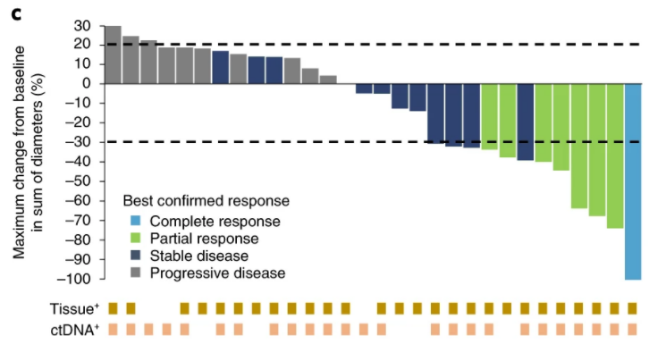
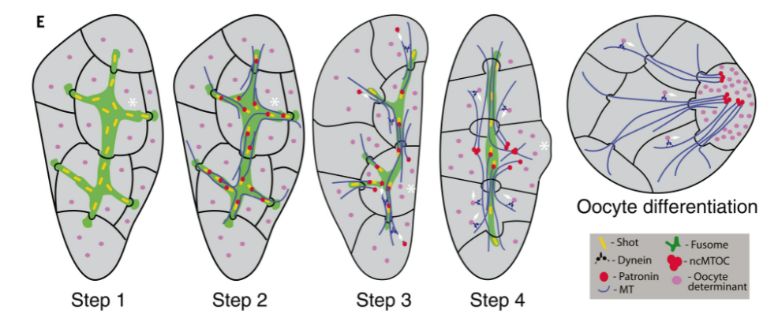

<!--
headingDivider: 1
backgroundColor: white
header: 2021年11月第3週
footer: \n
paginate: true
color:
class:
-->

# [TM] 低糖質食による脂質代謝の変化が腫瘍成長を抑制する
> Low glycaemic diets alter lipid metabolism to influence tumour growth | Nature
https://www.nature.com/articles/s41586-021-04049-2

+ カロリー制限やケトジェニックダイエットによって腫瘍成長を抑制できる、という話はこれまでもあったが、そのメカニズムはいまいちよく分かっていなかった。
+ 今回再試したところ、マウスの腫瘍移植片の成長はカロリー制限により抑制できたものの、ケトジェニックダイエットには効果が見られなかった。
+ この2群間で血漿・腫瘍組織中における脂質レベルが大きく異なっており、その構成が寄与しているのではないか？と考え検証、結果として腫瘍の不飽和脂肪酸合成がカロリー制限の場合に妨げられることに原因がある、という話のようだ。
  
こういう代謝の話はがん細胞全体で共有されているんだろうか。今回の移植片は Hela, Panc1, A549, あとマウス由来の腺癌細胞を使っているようだが、例えば上皮以外の細胞だと使う代謝も結構違うのではという気がする。

# [TM] 循環腫瘍DNAに応じた Pertuzumab + Trastuzumab 療法

> Circulating tumor DNA-guided treatment with pertuzumab plus trastuzumab for HER2-amplified metastatic colorectal cancer: a phase 2 trial | Nature Medicine
https://www.nature.com/articles/s41591-021-01553-w
+ ctDNA を見て HER2 が増幅されている転移性大腸がんについて Pertuzumab, Trastuzumab(共にHER2 への monoclonal 抗体だが、結合部位が違うらしい)併用療法を実施、奏効率は 30% だが、従来は 0%(!) だったのでかなりうまく行っている。
  + 具体的には各腫瘍のサイズの直径の減少率を見ているようだ
+ 治療開始から3週間後の応答性で大体予後を予測できる

ctDNA に応じて投薬対象をセレクションする、というのがすでに新しいらしいが、もっと進めて、ctDNA を観測しつつ投薬量を調整することで予後を最適化する、みたいな治療が出来るようになると、今勃興している強化学習の応用先として楽しい気がする(打てる手に倫理的な制限も入ってくるので確実に難しいとは思うが)。

# [DB] 雌性生殖嚢胞における対称性の破れ
> Symmetry breaking in the female germline cyst
https://www.science.org/doi/10.1126/science.abj3125
+ 生殖細胞が増殖した後、一つの細胞が卵母細胞となるが、この選択はどのようにして為されるのか？は分かっていなかった。
+ 今回微小管の - 端を安定化させる Patronin/CAMSAP と呼ばれるタンパク質の発現量によって決定していることを明らかにした。
  + 安定化タンパク質 → 数多くの微小管形成 → ダイニン輸送によるより多くの安定化タンパク質の獲得、というポジティブフィードバックループを形成しており、最終的に安定化タンパク質の量は1つの細胞が一人勝ちする仕組み。

# [TM] CRMP2-Ubc9 を抑制することで Nav1.7 を介し鎮痛する
> Selective targeting of NaV1.7 via inhibition of the CRMP2-Ubc9 interaction reduces pain in rodents
https://www.science.org/doi/10.1126/scitranslmed.abh1314
+ Nav1.7 チャネルを介した疼痛刺激の伝達は広く知られているが、これをターゲットとした有効な治療は未だ見つかっていない。
+ この論文では CRMP2-Ubc9 相互作用を抑制して間接的に Nav1.7 を抑える手法で、鎮痛が可能なことを示した。
  + CRMP2(コラプシン応答メディエータータンパク)は Nav1.7 と相互作用して活性化するが、そのためには SUMO の付加が事前に必要なので、これを抑える
+ SUMOylation サイトを対象として化合物を検索、その中の一つは経口摂取により鎮痛効果があり、依存性がなく、他の鎮痛薬との相乗効果も存在することを発見。

Rodent では、、としきりに注釈しているが、相乗効果が期待できるとなると、ヒトにも応用されればかなり売れそう。

# [TM] 自閉症による偏食のために腸内細菌叢も特徴的になる
> Autism-related dietary preferences mediate autism-gut microbiome associations: Cell
https://www.cell.com/cell/fulltext/S0092-8674(21)01231-9
+ 自閉症と腸内細菌叢も関わりについてはいろいろと報告されているが、潜在的な交絡因子などを扱えていないなど統計学的な問題があった。
+ 今回 247 例を用いてその関係を検証したところ、直接的な関係はほぼ無いことが分かった。
+ 一方で、自閉症による偏食が腸内細菌叢の多様性の低さに寄与し、結果として消化器症状を引き起こしていることが支持される。

腸内細菌叢の寄与で自閉症の特徴が生み出される、と読めるような話には注意が必要という話のようだ。言われてみれば食事内容をコントロールしないと腸内細菌叢を始点とした因果関係を考えることは厳しいが、食事の嗜好は体の状態と不可分な気もする。
糞便移植で効果が出ていれば信じられるか。

# [B] 島皮質による免疫応答の調節
> Insular cortex neurons encode and retrieve specific immune responses: Cell
https://www.cell.com/cell/fulltext/S0092-8674(21)01223-X

+ 脳免疫連関などが注目されてから20年ほど経ち、脳が末梢の免疫を制御していることを示す証拠が増えているが、脳が免疫系の状態をどのように表現しているのかは不明のままであった。
+ この論文では、脳の島皮質（InsCtx）が免疫に関連する情報を記憶していることを明らかにした。
  + マウスの活動依存性細胞標識法（FosTRAP）を用いて、2つの異なる炎症状態（デキストラン硫酸ナトリウム[DSS]誘発性大腸炎およびザイモサン誘発性腹膜炎）で活動するInsCtxの神経細胞アンサンブルを捉えた。
  + これらの神経細胞アンサンブルを化学遺伝学的に再活性化することで、炎症状態を広く再現することができた。
+ このように、私たちは、脳が特定の免疫反応を記憶し、取り出すことができることを示し、古典的な免疫学的記憶の概念を、炎症情報の神経細胞による表現にまで拡張した。

これすごいな。ひょっとしたら自己免疫疾患も Neuro-modulation で治療できるんじゃないか？という期待を持たせる。

# [B] 食事摂取量が減少することで新皮質は省エネモードへ
> Neocortex saves energy by reducing coding precision during food scarcity: Neuron
https://www.cell.com/neuron/fulltext/S0896-6273(21)00839-4

+ 脳での情報処理のために必要なエネルギーは高価なので、その出力を制御する機構があると考えられるが、そのメカニズムはされるかは不明であった。
+ この論文では、マウスの視覚野2/3層の全細胞記録と2光子イメージングを用いて、食物制限がAMPA受容体のコンダクタンスを低下させることで、シナプスのATP使用量を29％減少させることを発見している。
  + ニューロンの興奮性は、入力抵抗の代償的な増加と静止電位の脱分極によって維持 → ニューロンは費やす ATP は少ないままにコントロールと同様の速度でスパイクできる。
  + 一方、視覚から誘発される閾値以下の反応のゆらぎが増幅され、微細な視覚弁別ができなくなる。
+ このようなコーディング精度の低下は、脂肪量を調節するホルモンであるレプチンの減少と関連しており、レプチンを外因性に補充することで回復した。

AMPA 受容体のコンダクタンスはどうやって調整しているんだろうか。

# [B] cyclic CMP と UMP は細菌のファージに対する免疫で使われている
>Cyclic CMP and cyclic UMP mediate bacterial immunity against phages - ScienceDirect
https://www.sciencedirect.com/science/article/pii/S0092867421011144?via%3Dihub

+ cyclic-AMP および GMP はシグナル伝達のセカンドメッセンジャーとして有名だが、ピリミジン残基を持つ核酸である CMP, UMP などの環状ピリミジンに機能があるのかは不明であった。
+ この論文では、cCMPとcUMPが、細菌の抗ウイルス免疫において機能するセカンドメッセンジャーであることを報告している。
  + ファージ感染後にcCMPとcUMPを特異的に合成する細菌のピリミジンシクラーゼ酵素ファミリーを発見し、これらの分子が抗ウイルス反応を実行する免疫エフェクターを活性化することを明らかにした。
  + このファミリーのウリジル酸シクラーゼ酵素の結晶構造は、環化基質としてピリミジンを選択する分子メカニズムを説明している。
  + ピリミジンシクラーゼをコードする防御システムは、ここではPycsar (pyrimidine cyclase system for antiphage resistance)と呼ばれ、原核生物に広く存在している。

言われてみれば無いなと思ったが、不思議に思ったこともなかったな。
構造の類似性から、cAMP があれば多少の変異で cGMP も認識するようになるだろう、とは思うが、ピリミジン残基の方は受容体側の構造が結構違うので使っていないくてもそこまで不思議じゃないが。

# [TM] **好酸球**細胞外トラップによる喘息の増悪
> Eosinophil extracellular traps drive asthma progression through neuro-immune signals | Nature Cell Biology
https://www.nature.com/articles/s41556-021-00762-2?proof=t2019-5-29

+ 好中球が細胞外にクロマチンを放出する現象は、 NET (Neutrophil-extracellular traps) と呼ばれ自然免疫に関わるとして近年大いに注目を集めている。
+ この論文は、好酸球も同様にクロマチンフィラメントを放出しており、気管支肺胞洗浄液中の好酸球細胞外トラップ（EET）が、患者の喘息の重症度と関連していることを明らかにしている。
  + 機能的には、EETが杯細胞の過形成、粘液産生、炎症細胞の浸潤、タイプ2サイトカインの発現を増強する
  + 胸腺間質性リンパ球新生因子により、EETの形成を誘発する。
  + 機械的には、 EET が CCDC25-ILK-PKCα-CRTC1 経路を介して肺神経内分泌細胞を活性化し、肺神経内分泌細胞は、神経ペプチドや神経伝達物質を介してアレルギー性免疫反応を増幅させる。
    + CCDC25を阻害することで、アレルギー性炎症が緩和される。

好塩基球細胞外トラップもなにか役割無いかな？という100人中100人思いつきそうな疑問、そもそもクロマチン放出がどの範囲の血球まで行うのかも知らないが(顆粒球だけ？)

# [TM] PPARαを介してアストロサイトにAβを分解させる
>Activation of PPARα enhances astroglial uptake and degradation of β-amyloid
https://www.science.org/doi/10.1126/scisignal.abg4747

+ アミロイドβ (Aβ) は言うまでもなくアルツハイマー病患者の脳組織に沈着していることで有名で、この凝集が神経毒性を惹起していると考えられている。生理的には Aβ はうまく分解・処理されるわけなので、その処理機構を明らかにし、活性化させることでアルツハイマー病を治療することを考えるのは自然なアプローチだと言える。
+ この論文の筆者たちは私たちはこれまでに、低用量のゲムフィブロジル（GFB：高コレステロールの治療薬として承認されている薬剤）とレチノイン酸（RA：ビタミンA誘導体）の組み合わせが、リソソームの生合成やオートファジーのマスターレギュレーターである転写因子EB（TFEB）をコードする遺伝子のペルオキシソーム増殖因子活性化受容体α（PPARα）を介した転写を介して、リソソームの生合成を誘導することを発見した。その結果、GFB-RAは、PPARα依存的に細胞外からのAβの取り込みを促進し、アストロサイトでのAβの分解を促進することが明らかになった。GFB-RAは、PPARαを介して、アストロサイトにおける低密度リポタンパク質受容体（LDLR）とTFEBの両方の存在を刺激した。LDLRはAβの取り込みに重要であり、TFEBはAβの分解に重要であった。また、GFB-RAの投与は、アストロサイトのオートファジーフラックスとリソソーム活性を増加させた。これらの効果に加えて、アストロサイトのPPARαに依存した方法で、GFB-RAを経口投与すると、アストロサイトの活性化が神経保護状態に切り替わり、脳内のAβ負荷が低下し、アルツハイマー病の5XFADモデルマウスの空間学習と記憶が改善された。これらの結果は、PPARαがアストログリアの取り込みおよびAβの分解を促進するという新たな機能を明らかにしたものであり、GFB-RA併用療法のADに対する再利用の可能性を示唆するものである。

# [TM] 死んだ細胞ではなく、生きた細胞が抗腫瘍免疫を惹起する
>The injury response to DNA damage in live tumor cells promotes antitumor immunity
https://www.science.org/doi/10.1126/scisignal.abc4764

# [TM] FDG-PET はミクログリア活性を反映している？
> Microglial activation states drive glucose uptake and FDG-PET alterations in neurodegenerative diseases
https://www.science.org/doi/10.1126/scitranslmed.abe5640

# Reviews
## [TM] 痛みに寄与する神経回路とその介入方法
> Brain circuits for pain and its treatment
https://www.science.org/doi/10.1126/scitranslmed.abj7360

## [TM] 急性・慢性疼痛への nociceptor 選択的治療の勃興
> Developing nociceptor-selective treatments for acute and chronic pain
https://www.science.org/doi/10.1126/scitranslmed.abj9837

## [B] ヒト脳オルガノイド
> Human brain organogenesis: Toward a cellular understanding of development and disease: Cell
https://www.cell.com/cell/fulltext/S0092-8674(21)01177-6