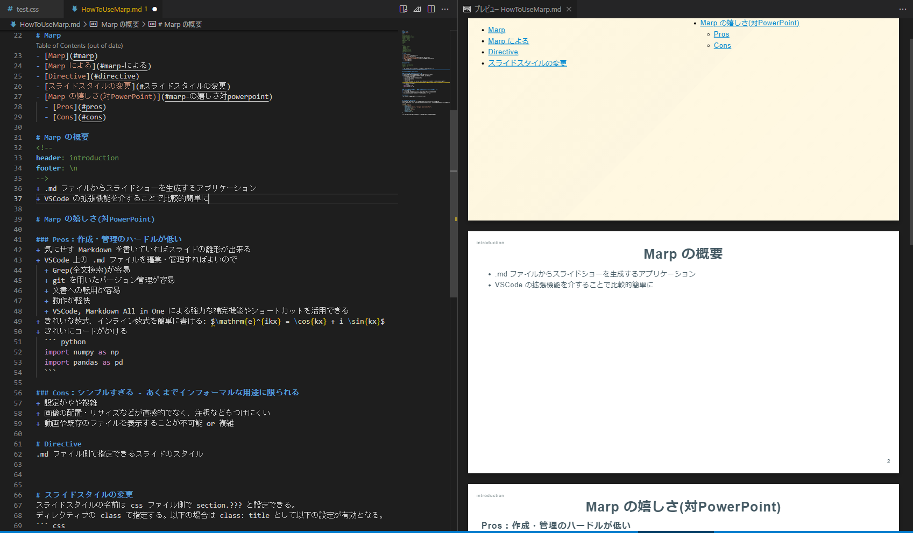

<!--
headingDivider: 1
backgroundColor: white
header: header
footer: footer
paginate: true
color:
class:
-->

<!--
_class: title
_header: \n
_footer: \n
_paginate: false
-->
# Marp
- [Marp](#marp)
- [Marp の概要](#marp-の概要)
- [Marp の嬉しさ(対PowerPoint)](#marp-の嬉しさ対powerpoint)
    - [Pros：作成・管理のハードルが低い](#pros作成管理のハードルが低い)
    - [Cons：シンプルすぎる - フォーマルな用途には使いにくい](#consシンプルすぎる---フォーマルな用途には使いにくい)
- [Install](#install)
  - [Marp(Marpit) - Qiita](#marpmarpit---qiita)
- [Start](#start)
- [スライドスタイルの変更](#スライドスタイルの変更)
- [要素ごとの設定](#要素ごとの設定)

# Marp の概要
<!--
header: introduction
footer: \n
-->
+ .md ファイルからスライドショーを生成するアプリケーション
+ VSCode の拡張機能を介することで比較的簡単に利用可能
+ .css ファイルによるスタイル全体の指定と、 .md ファイルによる内容の記述で構成
+ Marp-CLI (VSCode 拡張機能上で利用可能)を用いて .pdf, .html, .pptx 出力が可能



# Marp の嬉しさ(対PowerPoint)

### Pros：作成・管理のハードルが低い
+ 気にせず Markdown を書いていればスライドの雛形が出来る
+ VSCode 上の .md ファイルを編集・管理すればよいので
  + Grep(全文検索)が容易
  + git を用いたバージョン管理が容易
  + 文書への転用が容易
  + 動作が軽快
  + VSCode, Markdown All in One による強力な補完機能やショートカットを活用できる
+ きれいな数式、インライン数式を簡単に書ける: $\mathrm{e}^{ikx} = \cos{kx} + i \sin{kx}$
+ きれいにコードがかける
  ``` python
  import numpy as np
  import pandas as pd
  ```

### Cons：シンプルすぎる - フォーマルな用途には使いにくい
+ 設定がやや複雑
+ 画像の配置・リサイズなどが直感的でなく、注釈などもつけにくい
+ 動画や既存のファイルを表示することが不可能 or 複雑

# Install
<!--
header: 方法
-->
## [Marp(Marpit) - Qiita](https://qiita.com/takeshisakuma/items/5a61e6eac123d28602fb)

だいたいこの通りに従えばよいが、以下の VSCode 拡張機能も導入すると便利
+ Markdown All In One : 各種 Markdown に便利なショートカット、数式補完
+ Paste Image ： ctrl+alt+V でいい感じのフォルダに画像を保存した上で貼ってくれる


# Start
.md ファイルを新たに作成し、最初に marp を使用する旨とテーマを記述
```
--- markdown
marp: true
theme: test
---
```
このテーマ (今回は "test") が css ファイルを呼び出し、それに沿ってフォーマットされる。
各スライドは "Directive" と呼ばれるオプションにより変更できる。
``` markdown
<!--
headingDivider: 1      #見出しいくつでスライドを区切るか、の設定
backgroundColor: white #背景色、 rgba(69,179,224,1) 25%, とかも可能
header: header         #Header に書く文字列を指定
footer: footer         #Footer に書く文字列を指定
paginate: true         #スライドにページ番号を振るかを指定
color: black           # 文字色を指定
class:                 # スライドの"クラス"を指定できる。後述。
-->
```
他にもあるが背景画像のオプションなのでそこまで使用頻度は高くないと思う。
上のように記載すると、新しく設定変更されるまでの以降のスライドすべてに適用される。
これを ```header``` → ```_header``` などとすると、書かれたスライドだけに適用される。
Directive そのものもカスタマイズできるようだ。この辺をまとめてスニペットにしておくと ctrl+space で簡単に呼べて楽

# スライドスタイルの変更
スライドスタイルの名前は css ファイル側で section.??? と設定できる。
ディレクティブの class で指定する。以下の場合は ```class: title``` として以下の設定が有効となる。
``` css
section.title {
    color: black;
    font-family: "Arial", "Hiragino Maru Gothic ProN";
    font-size: 36px;
    text-align: center;
    padding: 40px;
    column-count: 2;
}
```
css くらい自由度があるので拡張性はものすごくある。
階層としては (1) スライド全体に及ぶ設定 (2) 見出しごとの設定 がある。

上の例は (1) スライド全体に及ぶ設定 になる。
+ コラム数
+ 通常の文字のフォント、フォントサイズ、文字色
+ 左寄せなのか右寄せなのか、文字間隔はどうするのか

などを指定する。 ```section {...}``` とした場合はデフォルトを設定する感じになるが、スライドサイズだけはそこでしか設定できない。

# 要素ごとの設定
``` css
section h1 {
    text-align: center;
    font-size: 40px;
    column-span: all;
}

section.title footer {
    font-size: 30px;
    text-align: center;
}

img[src*='#right'] { 
    position: absolute;
    top:  100px;
    left: 850px;
}
```
こちらでは各属性(画像なのか、見出しなのか、フッターなのか)ごとの設定を加えられる。
基本的には前のスライドと同じようなオプションになる。
画像については位置などを、ファイル名の末尾に適当な文字列をつなげて調整することが出来る。

この場合は ``` ```とすることで、上で設定された位置(上から100px, 左から 850px)を起点として貼り付けられる。```[]``` 内に色々指定してサイズや色合いも変更できる。